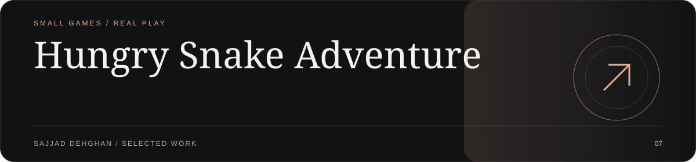
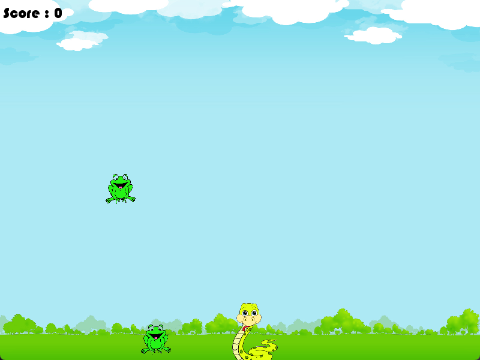
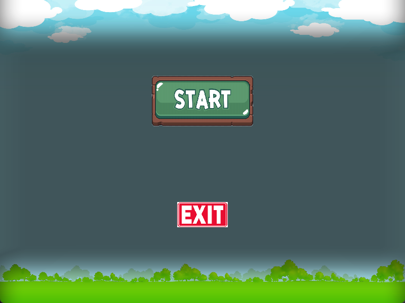

<!-- visual-showroom:start -->
<p align="center">
  
</p>

<p align="center">
  <strong>Hungry Snake Adventure</strong><br>
  SMALL GAMES / REAL PLAY
</p>

<p align="center">
  <a href="https://sajjad-dehghan-personal-site.prisoner-sedwna.workers.dev/projects/hungry-snake-adventure"><strong>Explore the showroom ↗</strong></a> ·
  <a href="#implementation--original-documentation">Setup &amp; implementation ↓</a>
</p>

A C++ game where a snake catches falling frogs. There's a terminal version and an SFML version with sound, speed that keeps rising, and a saved high score.

## Visual tour

[](https://sajjad-dehghan-personal-site.prisoner-sedwna.workers.dev/projects/hungry-snake-adventure)

<p align="center">
  <a href="https://sajjad-dehghan-personal-site.prisoner-sedwna.workers.dev/projects/hungry-snake-adventure"></a>
</p>

1. Actual SFML graphical gameplay · screenshot supplied by the project owner
2. Game start menu

Real captures or owner-supplied images, not generated product mockups. Demo/local data and edition boundaries are documented below.

## Implementation & original documentation

The existing run instructions, architecture, limitations and credits are preserved below.

---
<!-- visual-showroom:end -->

# Hungry Snake Adventure

A C++ arcade game for Windows: move a snake left and right to catch frogs before they hit the ground. There are two versions: a graphical one built with **SFML 2.5** and a simple console one.

## Screenshots

Actual screenshots of the graphical SFML version, supplied by the project owner on October 7, 2026. The SVG frames show the full 800 × 600 game canvas without desktop margins or the Windows title bar; original screenshot pixels are not regenerated.

### Gameplay


### Main menu


## Features

### Graphical Version (SFML)

- 800 x 600 window at 60 FPS, with a textured background and sprites for the snake and frogs.
- **Main menu** with **Start** and **Exit** buttons that you click with the mouse. `Esc` closes the window.
- **Two frogs** fall at once. The second one starts falling after the first has dropped partway down the screen.
- **The game speeds up.** Each catch makes the snake faster, and catching the first frog also makes the frogs fall faster.
- **Screen wrap:** if the snake moves off one side of the screen, it comes back on the other side.
- **Sound:** looping background music, plus sounds for catching a frog and for game over.
- **Score and high score:** each game's score is added to `record_status.txt`. The game-over screen shows your score, the best score so far, and a **Try Again** button.

### Terminal Version

- A 12 x 9 text board. The snake is `^` and the frog is `*`.
- Real-time input with `conio.h`, so you don't need to press Enter to move.
- The game gets faster as the delay between frames shrinks.
- Your score is shown at the top. The game ends as soon as a frog reaches the bottom row.

## Controls

| Key | Action |
| --- | --- |
| `A` | Move left |
| `D` | Move right |
| Mouse | Click Start, Try Again or Exit (graphical version) |
| `Esc` | Close the menu or game-over screen (graphical version) |

In the terminal version, the controls use lowercase `a` and `d`. At the `>` prompt, type `s` to start or `help` to see the commands.

## Requirements

- **Windows.** Both versions include `conio.h`, and the terminal version clears the screen with `cls`.
- **MinGW-w64 `g++`.** The graphical version comes with a prebuilt MinGW build of SFML 2.5 (headers, libraries and DLLs) in `Graphical Version/sfml/`. Your compiler must be compatible with that build. If it isn't, install a matching SFML 2.5.x.
- `make`, for example `mingw32-make`, to use the Makefile.

## Build and Run

```bash
git clone https://github.com/sedwna/Hungry-Snake-Adventure.git
cd Hungry-Snake-Adventure
```

### Graphical Version

```bash
cd "Graphical Version"
mingw32-make            # compiles src/*.cpp and links against sfml/lib -> app.exe
cp sfml/bin/*.dll .     # the SFML DLLs must be next to app.exe (or on PATH)
./app.exe
```

Run the game from inside `Graphical Version/`, because it loads `font/`, `picture/` and `sound/` using relative paths.

### Terminal Version

The terminal version doesn't use SFML, so you can compile it directly:

```bash
cd "Terminal Version"
g++ src/*.cpp -o hungry-snake.exe
./hungry-snake.exe
```

## Project Structure

```
Hungry-Snake-Adventure/
├── Graphical Version/
│   ├── include/        # app.hpp, game.hpp, snake.hpp, frog.hpp
│   ├── src/            # main.cpp, app.cpp (menu), game.cpp (game loop, collisions,
│   │                   #   score, try-again screen), snake.cpp, frog.cpp
│   ├── font/           # font.TTF
│   ├── picture/        # background, snake, frog and button images
│   ├── sound/          # background, eat and game-over sounds (.wav)
│   ├── sfml/           # bundled SFML 2.5 (include/, lib/, bin/)
│   └── Makefile
├── Terminal Version/
│   ├── include/        # app.hpp, snake.hpp, frog.hpp
│   ├── src/            # main.cpp, app.cpp (board, loop, scoring), snake.cpp, frog.cpp
│   └── Makefile
└── README.md
```

## Tech Stack

- C++
- [SFML 2.5](https://www.sfml-dev.org/) (graphics, window, system and audio modules) for the graphical version
- `conio.h` for real-time keyboard input in the terminal version
